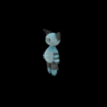

# NIA_39-1-2_pytorch_NeRF

- Reference source : https://github.com/yenchenlin/nerf-pytorch
- Reference Paper : https://arxiv.org/abs/2003.08934

과제명 : NIA 39-1-2 3D 에셋-이미지쌍 데이터 (2023.01.31)

# 1. 학습 환경 설치

학습데이터셋 구성
---------------------------------
	최상
	- Po : 1-5-23_20_minicooper-luggage-minicar_5_1_1_nurbs
	- Np : 2-16-2_24_leather-white-wood-3+-seater-recliner_5_5_1_polygon

	상
	- Po : 1-7-21_9_pink-cylinder-rice-cooker_4_2_1_nurbs
	- Np : 2-17-6_15_silver-round-streetlight_4_4_1_polygon

	중
	- Po : 1-5-16_12_knitted-toy-cat-stand_3_2_1_polygon
	- Np : 2-21-2_7_retro-style-mint-oven_3_3_1_polygon

	
	하
	- Po : 1-7-20_20_beige-body-juicer_2_2_1_nurbs
	- Np : 2-16-12_22_square-pillow-bean-bag_2_4_1_polygon

	최하
	- Po : 1-11-16_17_white-vivid-sport-goggles_1_2_1_polygon
	- Np : 2-14-10_24_Yellow-TopBottom-Solid-Square-Stool_1_2_1_nurbs
----------------------------------

하드웨어
---------------------------------
	GPU : NVIDIA A100
	Ubuntu : v18.04
---------------------------------

1.1. 도커 자동 실행 파일 작성 (docker_run.sh)
---------------------------------
	#도커 이미지명 (nia39-1/ubuntu/pytorch/nerf)
	
	## (1) 도커 파일로 이미지 만들기## 
	docker build -t nia39-1/ubuntu/pytorch/nerf -< dockerfile
	
	#도커 컨테이너 명 (pytorch_nerf)
	
	## (2) 도커 컨테이너 만들기## 
	docker run --gpus all --name pytorch_nerf -v $(pwd):/home/Nia_AI -p 3901:8888 -it nia39-1/ubuntu/pytorch/nerf:latest /bin/bash
	
	## (3) 도커 실행하기##
	docker start pytorch_nerf
	docker exec -it pytorch_nerf bash
---------------------------------

1.2. 도커 배치 파일 명령어 실행
---------------------------------
	bash docker_run.sh
---------------------------------

1.3. 컨테이너 접속 후 파이썬 버전 변경 
---------------------------------
	#python 확인 후 버전이 2.x 버전일 시 아래와 같이 명령어를 입력함.
	alias python=="python3"
---------------------------------

1.4. 폴더 이동 
---------------------------------
	cd /home/Nia_AI
---------------------------------

# 2. AI 모델 빌드

---------------------------------
	# 관련 코드 및 라이브러리 다운로드
	git clone https://github.com/Narnialabs/NIA_39-1-2_NeRF.git
	cd nerf-pytorch
	pip install -r requirements.txt

	# 데이터셋 압축풀기
	unzip dataset.zip
---------------------------------

2.1. NeRF 모델 학습 명령어 실행
---------------------------------
	python run_nerf.py --config ./config/asset_1_1.yaml --training True --testing True --rendering True --gpu_num 0 
	
	#"gpu_num"은 내가 사용하고자 하는 gpu의 번호
	#"config.yaml" 파일에 들어가서 학습하고자하는 에셋 및 학습 iteration을 변경할 수 있음 
---------------------------------

2.2. outputs
---------------------------------

	└── logs
	    ├── model
	    │   ├── tgt_class_model.tar # 학습 완료된 모델 저장
	    ├── checkpoint
	    │   ├── tgt_class_folder
	    │       ├── result_0.png # 500 번에 한번씩 체크포인트 결과 저장
	    │       ├── result_500.png
	    ├── testing
	    │   ├── tgt_class_folder
	    │       ├── TestSet_result.png # 테스트 결과 저장
	    │       ├── ValSet_result.png # 검증 결과 저장
	    ├── rendering
	    │   ├── tgt_class_video.png # 360 각도 뷰 렌더링 결과 저장

---------------------------------

# 3. Utils
---------------------------------
	# (1) 정사각 이미지가 아닌경우 crop_images.py 를 이용해서 정사각 이미지로 처리 할 수 있음.
	python crop_images.py --src_path [소스경로] --tgt_asset [타겟에셋명] --dst_path [저장경로](옵션[default './dataset/data_square/'폴더에 저장됨])
	
	# (2) colmap 으로 이미지를 추정해서 pose를 추정한 경우 colmap2nerf.py를 이용해서 nerf가 읽어들일수있는 데이터로 처리해줌.
	# 사전에 colmap_text 폴더를 만들어서 colmap의 output인 cameras.txt, images.txt를 넣어줌
	python colmap2nerf.py
---------------------------------
	
